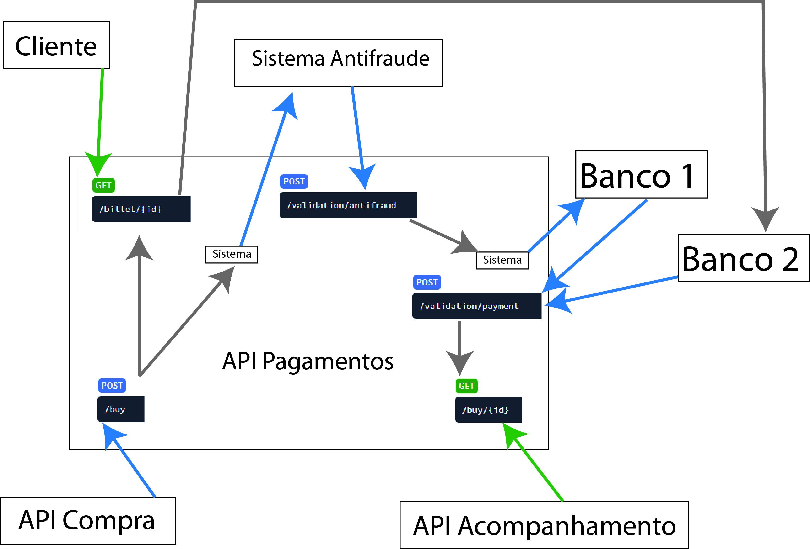
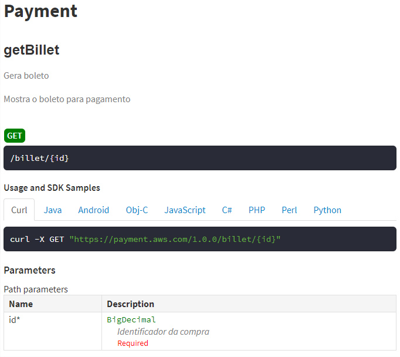
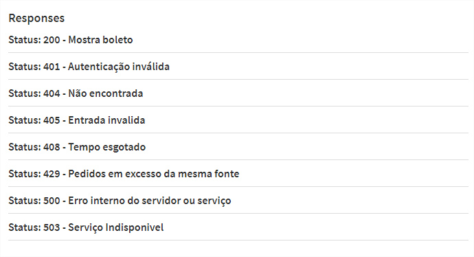
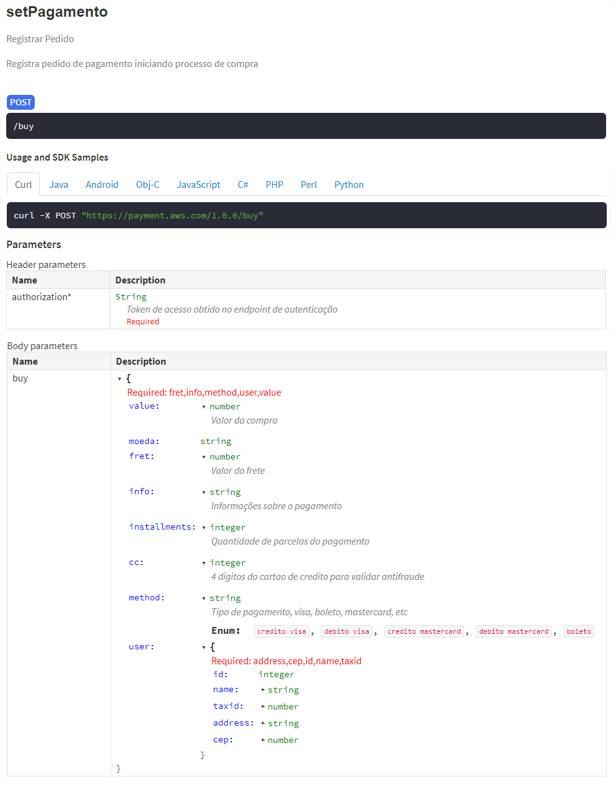
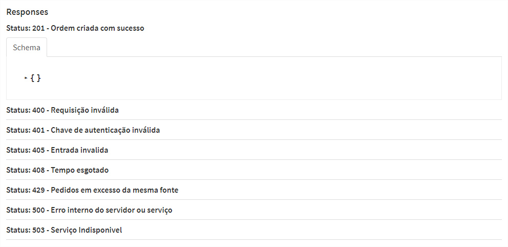
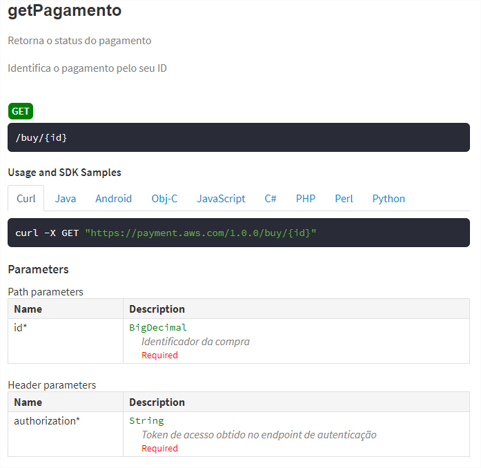
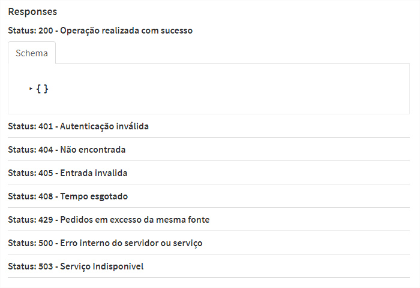
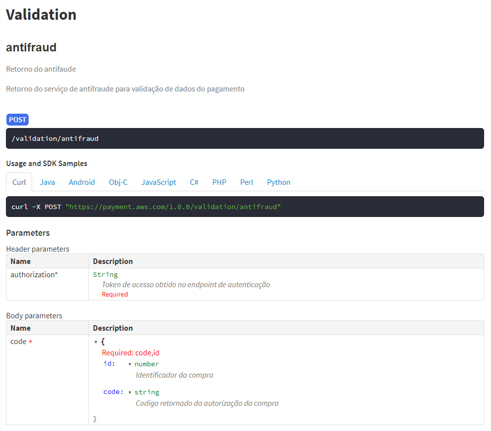
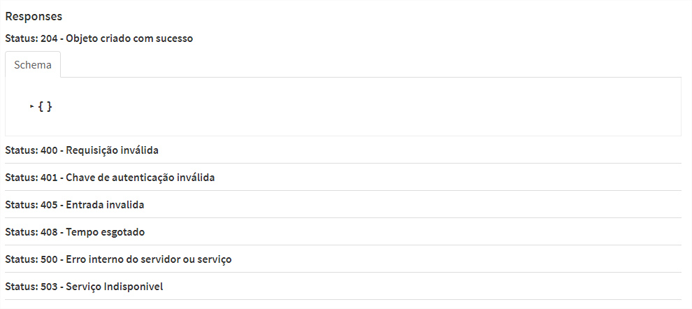
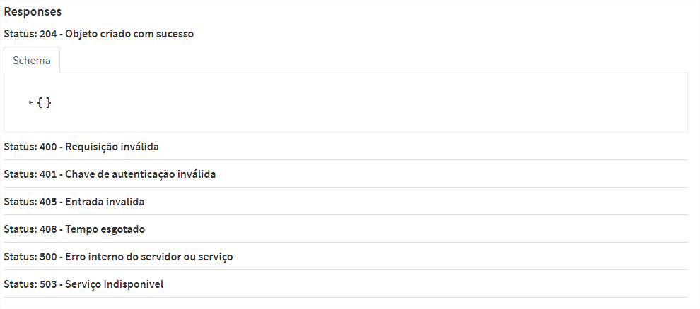

# AWS Projeto Final

Arquivo com o projeto swagger : swegger.yml

https://app.swaggerhub.com/apis-docs/Diogo-Perdigao/api-pagamentos/1.0.0

# Resumo
## API Pagamentos
- versão: 1.0.0
- Base URL: payment.aws.com/v2
- Este é um exemplo de serviço de validação de pagamentos

- Licença: ISC
- Schemes: https

### payment URL's de acesso interno
| Metodo | Caminho       | Resumo                        |
| :----: | :------------ | :---------------------------- |
| POST   | ​/buy​          | Registrar Pedido              |
| GET    | ​/buy​/{id}     | Retorna o status do pagamento |
| GET    | ​/billet​/{id}  | Gera boleto                   |

### validation URL's de acesso para serviços de terceiros
| Metodo | Caminho                 | Resumo               |
| :----: | :---------------------- | :------------------- |
| POST   | ​/validation​/fraud​/{id}  | Retorno do antifaude |
| POST   | ​/validation​/payment​/:id | Pagamento Aprovado   |

## Grupo
- Brandon Anderson
- Diogo Perdigão
- Frederico Americano
- Isabella Isaac
- Lucas Porto
- Nelson Carvalho

